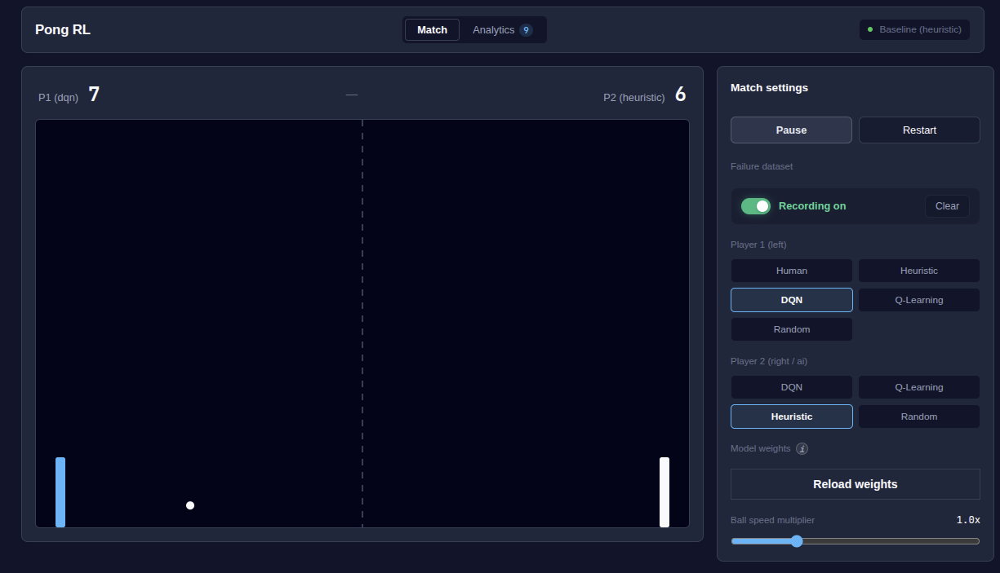

# Pong RL Studio



An interactive reinforcement learning environment and research suite for Pong. The platform features tabular Q-learning, deep Q-networks with n-step experience replay, a unified high-performance physics engine written in Rust compiled to both WebAssembly and native shared libraries, accelerated inference via ONNX Runtime, and a responsive web interface built with React.

## Key features

- Interactive dual-player simulation: play human versus artificial intelligence, artificial intelligence versus artificial intelligence, or heuristic rules versus trained neural agents in real time at 60 frames per second.
- Unified Rust physics engine:
  - Single source of truth for court physics implemented in Rust.
  - Compiled to WebAssembly for client-side browser execution and to a native C-ABI shared library for Python headless training.
  - Continuous swept bounding box collision detection with dynamic sub-stepping to eliminate ball tunneling at high velocities.
  - Realistic paddle deflection dynamics with transverse paddle friction, stochastic angular perturbation within plus or minus 3.5 degrees, and progressive post-impact acceleration.
- Reinforcement learning engines:
  - Tabular Q-learning: state space discretization mapping relative ball-to-paddle positions and directional velocities into deterministic action policies.
  - Deep Q-networks: deep neural network trained with n-step experience replay, decoupled target networks, smooth L1 Huber loss, and direct export to ONNX format.
- Curriculum learning support:
  - Practice wall mode: left-wall bounce environment designed to maximize hit density during early exploration stages.
  - Heuristic opponent mode: reactive adversary with adjustable tracking speed from 30 percent to 95 percent to train offensive shot placement.
- Containerized workflow: complete Docker and Docker Compose environment with optional NVIDIA GPU acceleration support.

## Performance benchmarks

| Agent | State representation | Average hits | Max rally | Inference latency |
| :--- | :--- | :---: | :---: | :---: |
| Tabular Q-learning | Discrete (5,760 states) | 12.26 | 15 | less than 0.05 ms |
| Deep Q-network (ONNX) | Continuous normalized vector | 9.97 | 12 | approx 0.8 ms |
| Reactive heuristic | Rule-based center tracking | 4.80 | 7 | less than 0.01 ms |

## Theoretical background

### Tabular Q-learning update rule

The tabular agent updates its action-value function via temporal difference learning:

$$Q(s_t, a_t) \leftarrow Q(s_t, a_t) + \alpha \left[ r_{t+1} + \gamma \max_{a'} Q(s_{t+1}, a') - Q(s_t, a_t) \right]$$

Key hyperparameters:
- Learning rate: 0.15
- Discount factor: 0.98
- Exploration schedule: epsilon-greedy policy decaying geometrically toward 0.02

### Deep Q-networks with n-step returns

To reduce bias during early training, the experience buffer computes multi-step accumulated returns:

$$R_t^{(n)} = \sum_{k=0}^{n-1} \gamma^k r_{t+k+1}$$

The network parameters are optimized by minimizing the Huber loss between evaluation and target networks:

$$\mathcal{L}(\theta) = \mathbb{E} \left[ \text{Smooth}_{L1} \left( R_t^{(n)} + \gamma^n \max_{a'} Q_{\theta^-}(s_{t+n}, a') - Q_\theta(s_t, a_t) \right) \right]$$

## Physics architecture and anti-tunneling

At high ball velocities (exceeding 15 pixels per frame), discrete frame updates can cause the ball to pass through paddle colliders. The unified Rust engine eliminates this artifact through continuous collision math:

1. Dynamic trajectory subdivision:
   $$\text{substeps} = \max\left(1, \; \left\lceil \frac{\sqrt{\Delta x^2 + \Delta y^2}}{4.0} \right\rceil\right)$$
2. Swept bounding box intersection testing at each sub-step.
3. Transverse friction transfer based on paddle linear velocity.
4. Bounded stochastic deflection jitter to prevent deterministic infinite loops.

## Quick start guide

### Prerequisites

- Docker and Docker Compose
- Optional: Git and GitHub CLI

### Running with Docker

Start both the backend API (FastAPI on port 8000) and the web interface (React on port 5173):

```bash
make up
```

Access points:
- Web interface: http://localhost:5173
- API documentation: http://localhost:8000/docs

### Compiling the Rust engine locally

To build the physics binaries directly outside of Docker:

```bash
# Build native shared library for Python backend
make build-rust

# Build WebAssembly package for React frontend
make build-wasm
```

## Model training and fine-tuning

### Training from scratch

To train models from an uninitialized state:

```bash
# Train tabular Q-learning against practice wall
make train ARGS="--episodes 30000 --opponent fronton"

# Train deep Q-network against practice wall
make train-dqn ARGS="--episodes 1200 --opponent fronton"
```

### Warm-restart fine-tuning

Fine-tuning refines an already trained model against the responsive heuristic bot rather than starting with uniform exploration:

#### Tabular Q-learning fine-tuning

Refine the discrete 5,760-state policy matrix using existing knowledge, targeted exploration, and lower learning rates:

```bash
make train ARGS="--pretrained models/q_table.npy --opponent heuristic --episodes 15000 --epsilon_start 0.15 --alpha 0.08"
```

Key arguments:
- `--pretrained models/q_table.npy`: Loads the existing Q-table checkpoint instead of initializing with zeros.
- `--opponent heuristic`: Trains against an intelligent, tracking opponent with dynamic shot angles and ball speed progression.
- `--epsilon_start 0.15`: Lowers initial exploration from 100 percent to 15 percent, preserving established defensive behavior while exploring refinements.
- `--alpha 0.08`: Uses a damped learning rate to prevent destructive policy oscillation.

#### Deep Q-network fine-tuning

Refine the continuous neural policy with PyTorch and automatically re-export the optimized ONNX model:

```bash
make train-dqn ARGS="--pretrained models/dqn_pong.pth --opponent heuristic --episodes 500 --epsilon_start 0.15 --lr 0.00015"
```

Key arguments:
- `--pretrained models/dqn_pong.pth`: Loads trained PyTorch weights for transfer learning.
- `--lr 0.00015`: Uses a conservative Adam learning rate to avoid destabilizing previously converged feature representations.
- `--episodes 500`: Performs targeted adaptation runs before saving both PyTorch (`.pth`) and ONNX (`.onnx`) checkpoints.

### Failure-targeted fine-tuning

When playing in the web interface with failure recording enabled, missed shots are automatically recorded to `data/failed_shots.json`. You can run a dedicated clinic fine-tuning run targeting only those specific trajectories:

```bash
make train-failures
```

### Evaluating trained models

Evaluate pure greedy performance ($\epsilon = 0$) over 200 benchmark episodes:

```bash
# Evaluate tabular Q-learning
make eval-tabular

# Evaluate deep Q-network
make eval-dqn
```

### Hot-reloading weights in the live web session

After fine-tuning, you can update the running browser match without restarting Docker containers by clicking the **Reload weights** button in the settings sidebar or issuing a `POST` request to `/api/reload_models`. Tabular Q-learning immediately synchronizes the new 69 KB matrix into WebAssembly memory at 0 ms latency.

## Repository structure

```text
pong/
├── backend/
│   ├── constants.py        # Environment dimensions and physics constants
│   ├── rust_bridge.py      # Ctypes interface to native Rust physics library
│   ├── env.py              # Simulation environment for RL training
│   ├── buffer.py           # N-step experience replay buffer
│   ├── model.py            # Q-table agent and ONNX Runtime inference
│   ├── train.py            # Training pipeline and evaluation routines
│   └── main.py             # FastAPI REST endpoints and websocket feeds
├── frontend/
│   ├── src/
│   │   ├── wasm/           # Compiled WebAssembly modules and JavaScript bindings
│   │   ├── components/
│   │   │   ├── PongCanvas.jsx    # Canvas rendering driven by WebAssembly physics
│   │   │   ├── ControlsPanel.jsx # Gameplay mode and difficulty settings
│   │   │   └── QTableViewer.jsx  # Real-time Q-table policy heatmap
│   │   └── App.jsx
│   └── package.json
├── rust/
│   └── pong_physics/       # Unified physics implementation (C-ABI and WebAssembly)
├── models/
│   ├── q_table.npy         # Trained tabular weights
│   ├── dqn_pong.onnx       # Exported deep Q-network in ONNX format
│   └── dqn_pong.pth        # PyTorch checkpoint weights
├── Dockerfile
├── docker-compose.yml
├── Makefile
├── start.sh
└── README.md
```

## License

Distributed under the MIT License.
